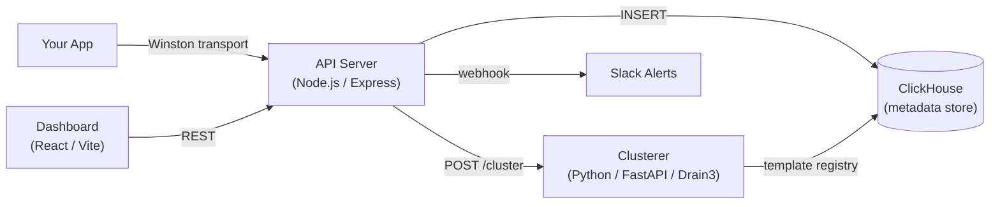
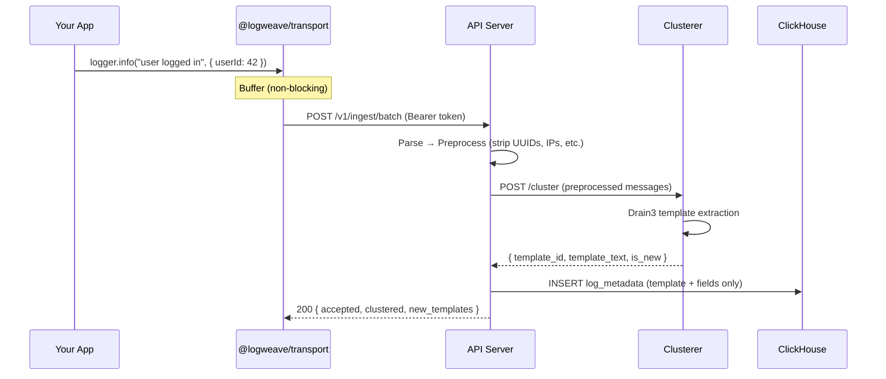

# LogWeave

**Log intelligence platform** — extracts patterns from your logs, tracks occurrence trends, detects anomalies, and discards the raw content. Your raw logs stay in your infrastructure (S3, CloudWatch, etc.). LogWeave stores only metadata and intelligence.

## Architecture





## Prerequisites

| Tool | Version | Install |
|------|---------|---------|
| Node.js | 24+ | [nodejs.org](https://nodejs.org) |
| Python | 3.11+ | [python.org](https://python.org) |
| pnpm | 9+ | `npm i -g pnpm` |
| uv | latest | `pip install uv` |
| Docker | 24+ | [docker.com](https://docker.com) |

## Quickstart

```bash
# Clone and start everything
git clone https://github.com/RobertDicker/logweave.git
cd logweave
docker compose up --build
```

Three containers start:

| Service | Port | Health |
|---------|------|--------|
| ClickHouse | 8123 (HTTP), 9000 (native) | `curl localhost:8123/ping` |
| Clusterer | 8000 | `curl localhost:8000/health` |
| API Server | 3000 | `curl localhost:3000/healthz` |

Send test logs:

```bash
curl -X POST http://localhost:3000/v1/ingest/batch \
  -H "Content-Type: application/json" \
  -H "Authorization: Bearer e2e-key-tenant-a" \
  -d '{
    "service": "demo",
    "events": [
      {"message": "User 12345 logged in from 192.168.1.1", "level": "info"},
      {"message": "User 67890 logged in from 10.0.0.1", "level": "info"},
      {"message": "Payment failed for order abc-123", "level": "error"}
    ]
  }'
```

## Local Development

### API Server

```bash
cd services/api
pnpm install
pnpm dev          # tsx watch + pino-pretty
pnpm test         # all tests (unit + integration)
pnpm test:unit    # unit tests only
pnpm lint         # Biome check
pnpm typecheck    # tsc --noEmit
```

Requires ClickHouse running locally for integration tests:

```bash
docker compose up clickhouse -d
```

### Clusterer

```bash
cd services/clusterer
uv sync --dev
uv run poe serve   # dev server with hot reload
uv run poe test    # pytest
uv run poe check   # ruff lint + format check
```

### Transport SDK

```bash
cd packages/transport
pnpm install
pnpm test
```

### Everything at once

```bash
./dev.sh test      # run all tests across all services
./dev.sh lint      # lint everything
./dev.sh dev       # start dev servers
./dev.sh build     # build all services
```

## Project Structure

```
logweave/
├── services/
│   ├── api/              Node.js Express TypeScript — ingestion, queries, dashboard
│   └── clusterer/        Python FastAPI Drain3 — template extraction
├── packages/
│   └── transport/        @logweave/transport — Winston logger transport (npm, MIT)
├── docs/
│   ├── adr/              Architecture Decision Records
│   └── lessons-learned.md
├── docker-compose.yml    3-container stack (API + Clusterer + ClickHouse)
├── PLAN.md               Full architecture plan (V8)
└── CLAUDE.md             Claude Code project instructions
```

## Key Design Decisions

- **No raw log storage** — only metadata and extracted patterns are persisted
- **Two-language stack** — Drain3 has no production Node.js equivalent; Python handles clustering, Node.js handles everything else
- **Docker Compose, not Kubernetes** — operational simplicity for solo maintainer
- **UUIDv7 for all IDs** — globally unique, timestamp-sortable, no coordination needed
- **Best-effort clustering** — 500ms timeout with graceful degradation to `[unclustered]`

See [docs/adr/](docs/adr/) for detailed Architecture Decision Records.

## Docker Compose Tips

**Readable logs** — API server outputs structured JSON (pino). Pipe through pino-pretty for human-readable output:

```bash
docker compose logs -f api | npx pino-pretty
```

**Run a single service** — useful for local dev when you only need ClickHouse:

```bash
docker compose up clickhouse -d        # just ClickHouse
docker compose up clickhouse clusterer -d  # ClickHouse + clusterer
```

**Reset data** — ClickHouse data persists in a named volume. To start fresh:

```bash
docker compose down -v   # removes volumes too
```

**Default credentials** — Docker Compose uses `default:logweave` for ClickHouse and e2e API keys (`e2e-key-tenant-a`, `e2e-key-tenant-b`) for the API server. See [.env.example](services/api/.env.example) for local dev config.

## Links

- [Architecture Plan (PLAN.md)](PLAN.md)
- [Architecture Decision Records](docs/adr/)
- [API Server README](services/api/README.md)
- [Clusterer README](services/clusterer/README.md)
- [Transport SDK README](packages/transport/README.md)
