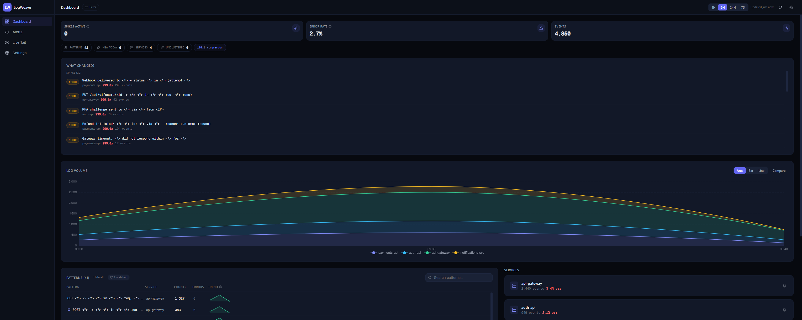
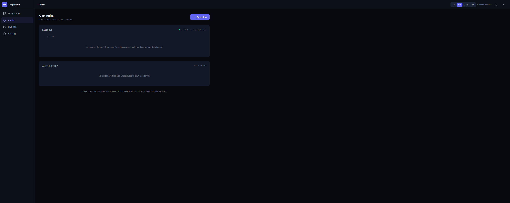

# LogWeave

**Log intelligence for AI agents.** LogWeave extracts patterns from your logs and makes them queryable by your AI coding assistant. Your AI already knows your codebase — LogWeave tells it what's happening at runtime.



## What It Does

You send logs. LogWeave clusters them into patterns, detects anomalies, and exposes structured intelligence via 21 MCP tools. Your AI can then answer questions like:

- *"What new error patterns appeared after my last deploy?"*
- *"Is my payment-service error rate abnormal right now?"*
- *"What other services are affected when auth times out?"*

**LogWeave never stores raw log content.** It extracts patterns, metadata, and intelligence — then discards the rest. Raw logs stay in your infrastructure (S3/CloudWatch).

## Quick Start

```bash
git clone https://github.com/RobertDicker/logweave.git
cd logweave
cp .env.production.example .env
# Edit .env — set LOGWEAVE_API_KEYS and LOGWEAVE_ENCRYPTION_KEY
docker compose -f docker-compose.prod.yml up -d
```

Open `http://localhost:3000` and log in with `admin` / `admin` (you'll be prompted to change the password).

**Send your first log:**

```bash
curl -X POST http://localhost:3000/v1/ingest/batch \
  -H "Authorization: Bearer YOUR_API_KEY" \
  -H "Content-Type: application/json" \
  -d '{"events": [{"message": "User login succeeded", "level": "INFO", "service": "auth-service"}]}'
```

**Connect your AI:**

Add to your editor's MCP config (Claude Code, Cursor, Windsurf, VS Code):

```json
{
  "mcpServers": {
    "logweave": {
      "command": "npx",
      "args": ["@logweave/mcp"],
      "env": {
        "LOGWEAVE_API_URL": "http://localhost:3000",
        "LOGWEAVE_API_KEY": "YOUR_API_KEY"
      }
    }
  }
}
```

Then ask your AI: *"What error patterns are happening in my services?"*

## Features

### Pattern Detection
LogWeave clusters log messages into templates using [Drain3](https://github.com/logpai/Drain3). Instead of millions of individual log lines, you get hundreds of meaningful patterns with occurrence counts, trends, and anomaly scores.

### 21 MCP Tools
Your AI assistant gets structured access to your production runtime:

| Tool | What it does |
|------|-------------|
| `overview` | System snapshot — events, patterns, error rate, services |
| `error_patterns` | Top errors sorted by frequency |
| `changes` | New patterns, spikes, and resolved issues |
| `diagnose_service` | Health + outlier detection + recent changes (3-in-1) |
| `search_templates` | Find patterns by text (substring or semantic) |
| `template_detail` | Full context — sparkline, status codes, first/last seen |
| `correlations` | Statistically correlated patterns (Pearson r) |
| `related_patterns` | Co-occurring patterns in the same request |
| `trace_details` | Cross-service trace timeline |
| `raw_logs` | S3-backed raw log drill-down |
| `live_tail` | Real-time event stream |
| `deploys` | Deployment markers for change correlation |
| `create_rule` | Create threshold alerts programmatically |
| ...and 8 more | See `services/mcp/src/tools.ts` for all tools |

### Real-Time Dashboard


- KPI strip — spikes, error rate, event volume
- What Changed — new patterns, spikes, resolved issues
- Volume chart — per-service log volume over time
- Pattern table — sortable, searchable, with sparkline trends
- Service health cards — error rates and top patterns per service
- Live tail — real-time event stream with filters
- Alert rules — threshold and pattern-based with Slack/PagerDuty

### Alerting

Set up alerts in minutes from the dashboard — no config files, no YAML.

- **Threshold rules** — "Alert me when error count > 50 in 5 minutes for payment-service" → Slack message in seconds
- **Pattern watches** — click "Watch" on any log pattern → get notified the next time it appears
- **Slack** — paste your webhook URL in Settings, done. Test with one click.
- **PagerDuty** — add your routing key as a channel, LogWeave sends Events API v2 payloads
- **Generic webhooks** — any HTTPS endpoint receives structured JSON alerts
- **Cooldown** — configurable per rule (1 min to 24 hours) to prevent alert fatigue
- **Your AI can create rules too** — `create_rule` MCP tool lets your AI set up alerts programmatically



### Security
- Username/password login with forced password change
- Optional TOTP 2FA (Google Authenticator, Authy)
- Account lockout after failed attempts
- Admin/viewer roles with team management
- API key auth for SDK and MCP (separate from dashboard login)
- All secrets encrypted at rest (AES-256-GCM)
- Session cookies (httpOnly, secure, sameSite)
- Audit trail for all auth events


## Architecture

```
Your Apps ──→ LogWeave API ──→ Clusterer (Drain3) ──→ ClickHouse
                  │                                        │
                  ├── Dashboard (React)                    │
                  ├── MCP Server (21 tools)                │
                  └── Alerts (Slack/PagerDuty) ◄───────────┘

Raw logs stay in YOUR S3 ──→ LogWeave reads on demand (drill-down)
```

**Three containers:** API Server (Node.js/Express), Clusterer (Python/FastAPI/Drain3), ClickHouse.

LogWeave stores only metadata and patterns — never raw log content. Raw logs stay in your S3 bucket and are read on demand for drill-down.

## Ingestion Methods

| Method | Use case |
|--------|----------|
| **SDK** (`@logweave/transport`) | Node.js apps with Winston/Pino |
| **HTTP API** (`POST /v1/ingest/batch`) | Any language — curl, Go, Python, Java |
| **OpenTelemetry** (`POST /v1/logs`) | OTel Collector integration |

## Documentation

- [Self-Hosted Install Guide](docs/install.md) — 5-minute setup with Docker Compose
- [Configuration Reference](docs/install.md#environment-variable-reference) — all env vars

## Tech Stack

- **API Server:** Node.js 24 / Express / TypeScript
- **Clusterer:** Python 3.11 / FastAPI / Drain3
- **Metadata Store:** ClickHouse (ReplacingMergeTree)
- **Dashboard:** React / Vite / Tailwind CSS 4 / ECharts
- **MCP Server:** `@logweave/mcp` (stdio transport)
- **Infrastructure:** Docker Compose

## Development

```bash
# API server
cd services/api && pnpm install && pnpm dev

# Clusterer
cd services/clusterer && uv sync --dev && uv run poe serve

# Dashboard
cd services/dashboard && pnpm install && pnpm dev

# Tests
cd services/api && pnpm test        # 635 unit tests
cd services/clusterer && uv run poe test  # 106 tests
```

## License

MIT
