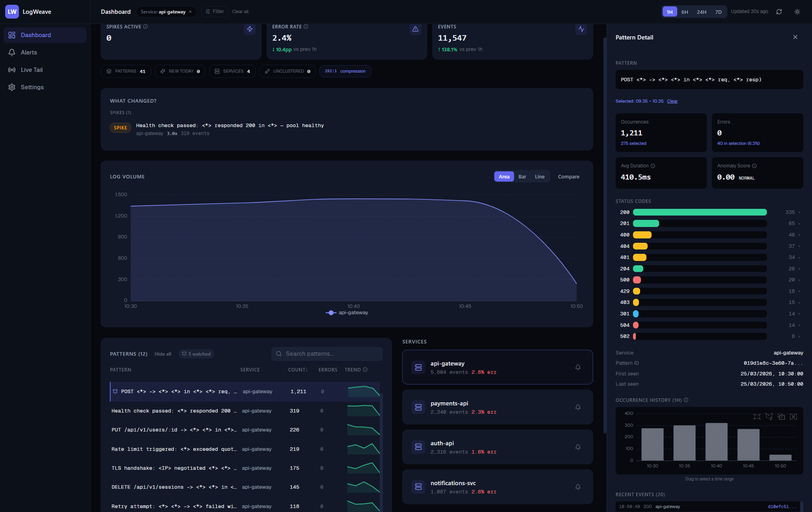
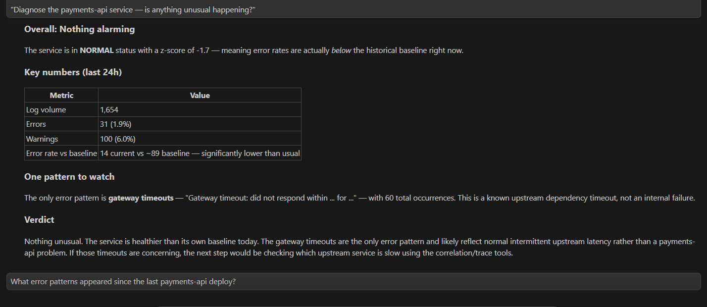
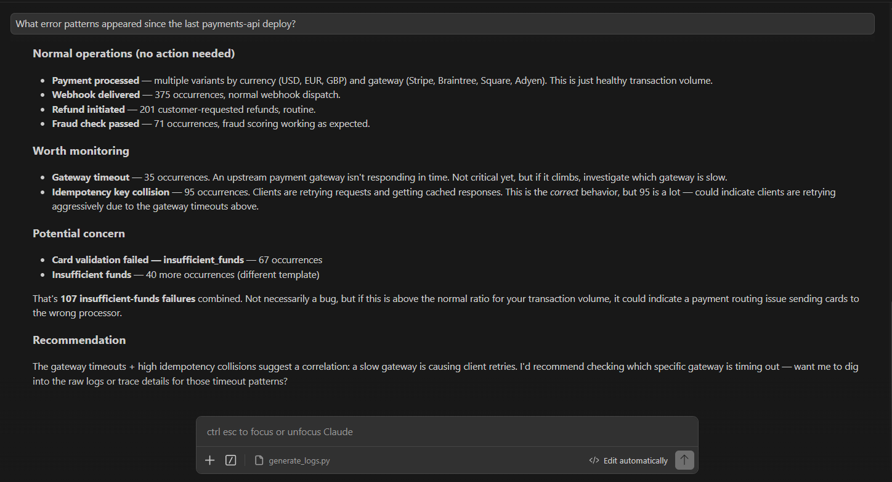
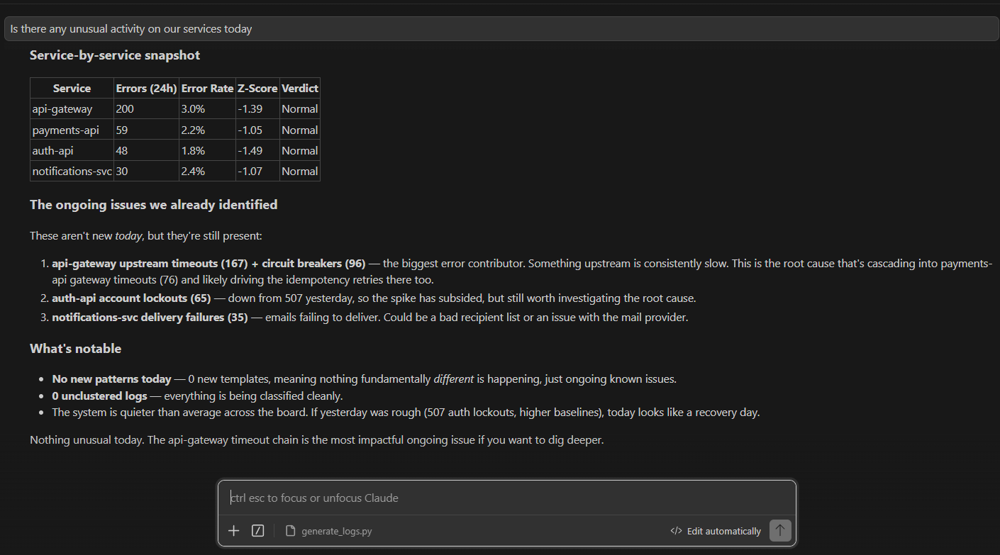
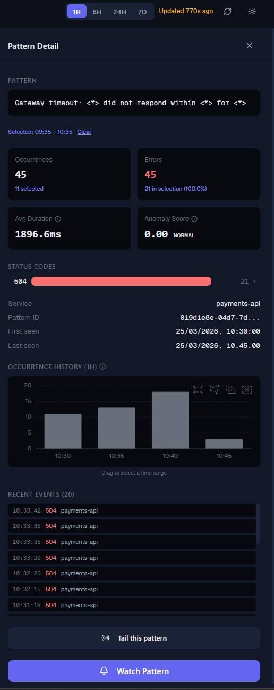
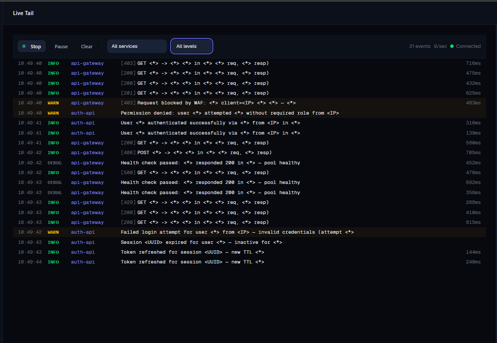
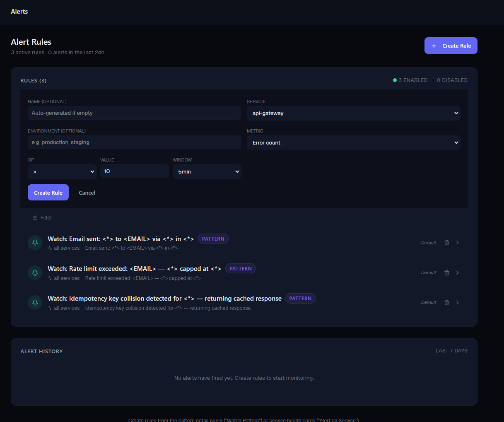

# LogWeave

**Log intelligence for AI agents.** LogWeave extracts patterns from your logs and makes them queryable by your AI coding assistant. Your AI already knows your codebase — LogWeave tells it what's happening at runtime.



*"Diagnose the payments-api service — is anything unusual happening?"*



*"What error patterns appeared since the last deploy?"*



## What It Does

You send logs. LogWeave clusters them into patterns, detects anomalies, and exposes structured intelligence via 26 MCP tools. Raw logs stay in your infrastructure — LogWeave stores only the patterns, metadata, and custom fields you configure.

LogWeave works alongside your existing logging stack. It adds an AI-queryable intelligence layer on top — it doesn't replace your log storage or search tools.

LogWeave is an analytics layer, not a log reader. Tools that pipe raw logs over MCP just make your AI grep — burning tokens re-reading text. LogWeave does the clustering, baselining, anomaly scoring, and correlation up front, then hands your AI structured answers: which patterns are spiking, what's anomalous *for this hour*, and what changed since the deploy. Unlike inline log-reduction pipelines that sit in front of a paid backend to cut volume, it runs *beside* your stack — it doesn't intercept or gate your log flow.

**Who it's for:** developers and budget-conscious teams whose logs already live in cloud storage — CloudWatch, S3, or similar — where getting quick, targeted answers out of them isn't always easy. If a full observability platform is more than you need, and what you actually want is to see *which* errors are firing, *when* they started, and *what happened next* in the sequence, LogWeave focuses on exactly those questions — without shipping your logs to a third-party service.

## Quick Start

```bash
git clone https://github.com/logweave/logweave.git
cd logweave
cp .env.production.example .env
# Edit .env — set LOGWEAVE_API_KEYS and LOGWEAVE_ENCRYPTION_KEY
docker compose -f docker-compose.prod.yml up -d
```

On first start, LogWeave creates a default `admin` user and prints a one-time random password to **stderr** (look for the `LOGWEAVE BOOTSTRAP` banner). Capture it from your container logs (`docker compose logs api`) and log in at `http://localhost:3000` — you'll be required to change it on first login.

**Send your first log:**

```bash
curl -X POST http://localhost:3000/v1/ingest/batch \
  -H "Authorization: Bearer YOUR_API_KEY" \
  -H "Content-Type: application/json" \
  -d '{"events": [{"message": "Payment failed: gateway timeout for order 4821", "level": "ERROR", "service": "payments-api"}]}'
```

**Connect your AI:**

Add to your editor's MCP config (Claude Code, Cursor, Windsurf, VS Code):

```json
{
  "mcpServers": {
    "logweave": {
      "command": "npx",
      "args": ["@logweave/mcp"],
      "env": {
        "LOGWEAVE_API_URL": "http://localhost:3000",
        "LOGWEAVE_API_KEY": "YOUR_API_KEY"
      }
    }
  }
}
```

Then ask your AI: *"What error patterns are happening in my services?"*

## Features

### Deploy-Anchored Change Detection

Anchor any query to a deployment and instantly see what's new, what's spiking, and what resolved. *"What broke after my deploy?"* is one question away.

### Anomaly Detection

Each log pattern is continuously scored against a 7-day baseline matched by hour-of-day (UTC). No manual thresholds to configure — LogWeave tells you whether an error rate is normal or a statistical outlier automatically, with the same hour-of-day comparison so a quiet 3 AM doesn't look anomalous and a busy 3 PM doesn't hide real spikes.



### Cross-Service Correlation

LogWeave finds statistically correlated patterns across services using Pearson r. When auth starts timing out and payment failures spike at the same time, you'll see them linked — not buried in separate dashboards.

### Semantic Pattern Search

Search patterns by meaning, not just keywords. *"database slow"* matches *"connection pool exhausted"*. Your AI uses this automatically when investigating issues.

### Log Cost Optimizer

Identify noisy, high-volume log patterns that drive up your logging costs. LogWeave classifies every pattern by volume percentage and level — DEBUG patterns consuming 60% of a service's volume are flagged as noise, high-volume INFO patterns are flagged for sampling review. Configurable per-tenant thresholds let each team tune what "noisy" means for them.

Available via dashboard widget, REST API (`GET /v1/cost/analysis`), and MCP tool (`cost_optimizer`). Your AI can tell you exactly where to cut logging costs.

### Pattern Clustering

Millions of individual log lines become hundreds of meaningful patterns with occurrence counts, sparkline trends, and anomaly scores. You see signals, not noise.

### 26 MCP Tools

Your AI assistant gets structured access to your production runtime:

| Tool | What it does |
|------|-------------|
| `overview` | System snapshot — events, patterns, error rate, services |
| `error_patterns` | Top errors sorted by frequency |
| `changes` | New patterns, spikes, and resolved issues since a deploy |
| `diagnose_service` | Health + outlier detection + recent changes (3-in-1) |
| `search_templates` | Find patterns by text (substring or semantic) |
| `template_detail` | Full context — sparkline, status codes, first/last seen |
| `correlations` | Statistically correlated patterns (Pearson r) |
| `related_patterns` | Co-occurring patterns in the same request |
| `trace_details` | Cross-service trace timeline |
| `raw_logs` | Raw log drill-down (S3, Elasticsearch, Loki, local filesystem) |
| `live_tail` | Real-time event stream |
| `deploys` | Deployment markers for change correlation |
| `cost_optimizer` | Identify noisy patterns and volume reduction opportunities |
| `create_rule` | Create threshold alerts programmatically |
| ...and 12 more | See [`docs/mcp-tools.md`](docs/mcp-tools.md) for all tools |

### Real-Time Dashboard


- KPI strip — spikes, error rate, event volume at a glance
- What Changed — new patterns, spikes, resolved issues
- Volume chart — per-service log volume over time
- Cost optimizer — noisy patterns flagged with volume reduction estimates
- Pattern table — sortable, searchable, with sparkline trends
- Service health cards — error rates and top patterns per service



Click any pattern to drill into occurrence counts, status code breakdown, and hourly sparklines.

### Live Tail

Stream logs in real-time across all services with filtering by service, level, and pattern.



### Alerting

Set up alerts in minutes from the dashboard — no config files, no YAML.

- **Threshold rules** — "Alert me when error count > 50 in 5 minutes for payment-service" — Slack message in seconds
- **Pattern watches** — click "Watch" on any log pattern, get notified the next time it appears
- **Slack, PagerDuty, generic webhooks** — paste a URL, done
- **Cooldown** — configurable per rule (1 min to 24 hours) to prevent alert fatigue
- **Your AI can create rules too** — `create_rule` MCP tool lets your AI set up alerts programmatically



### Self-Hosted and Private

LogWeave runs entirely in your infrastructure. Raw logs never leave your environment — LogWeave reads them on demand for drill-down, but only stores extracted patterns and metadata. Nothing is sent to external services.

### Raw Log Connectors

Connect your log source in Settings for raw log drill-down from any pattern:

| Connector | Setup | Auth |
|-----------|-------|------|
| **Amazon S3** | Bucket, region, path pattern | IAM AssumeRole |
| **Elasticsearch / OpenSearch** | URL, index pattern | None, API key, or basic auth |
| **Grafana Loki** | URL, label selector | Optional bearer token |
| **Local Filesystem** | Directory path, file pattern | None (Docker volume mount) |

One connector per tenant. Configured by admins in Settings — paste a URL and test.

### Data Handling

LogWeave stores **patterns and metadata, not raw logs**. When a log message is ingested:

1. **Pre-processing** strips UUIDs, timestamps, emails, IPs, and numeric IDs
2. **Clustering** extracts a template pattern (e.g. `Connection to <*> failed after <*>ms`)
3. **Only the template ID, metadata, and statistics** are stored permanently

For events that fail clustering (e.g. clusterer timeout), a pre-processed version of the message is temporarily stored so it can be re-clustered later. This pre-processed text has high-cardinality tokens removed but may still contain some original message content. Once successfully clustered, it is set to null. If your logs contain sensitive data (PII, payment details), consider adding custom pre-processing rules or restricting which services send logs to LogWeave.

### Security
- Username/password login with forced password change
- Optional TOTP 2FA (Google Authenticator, Authy)
- Account lockout after failed attempts
- Admin/viewer roles with team management
- API key auth for SDK and MCP (separate from dashboard login)
- All secrets encrypted at rest (AES-256-GCM)
- CSRF protection (double-submit cookie)
- Session cookies (httpOnly, secure, sameSite)
- Audit trail for all auth events

## Architecture

```
Your Apps ──→ LogWeave ──→ Your AI
                 │
                 ├── Dashboard
                 ├── MCP Server (26 tools)
                 └── Alerts (Slack/PagerDuty)
```

LogWeave runs as a single `docker compose up` — three containers, nothing else to manage. Raw logs stay in your S3 bucket; LogWeave stores only patterns and metadata.

## Ingestion Methods

| Method | Use case |
|--------|----------|
| **SDK** (`@logweave/transport`) | Node.js apps with Winston/Pino |
| **HTTP API** (`POST /v1/ingest/batch`) | Any language — curl, Go, Python, Java |
| **OpenTelemetry** (`POST /v1/logs`) | OTel Collector integration |

> **Beta durability note:** ingest is synchronous with no durable queue. If ClickHouse
> is down, the API returns `503` + `Retry-After` (the `@logweave/transport` SDK retries
> automatically) rather than queueing. For guaranteed delivery, front LogWeave with a
> buffering collector (e.g. Vector). See [Durability](docs/install.md#durability-beta-limitation).

## Documentation

- [Self-Hosted Install Guide](docs/install.md) — 5-minute setup with Docker Compose
- [Configuration Reference](docs/install.md#environment-variable-reference) — all env vars

## Tech Stack

- **API Server:** Node.js 24 / Express / TypeScript
- **Clusterer:** Python 3.11 / FastAPI / Drain3
- **Metadata Store:** ClickHouse (ReplacingMergeTree)
- **Dashboard:** React / Vite / Tailwind CSS 4 / ECharts
- **MCP Server:** `@logweave/mcp` (stdio transport)
- **Infrastructure:** Docker Compose

## Development

```bash
# API server
cd services/api && pnpm install && pnpm dev

# Clusterer
cd services/clusterer && uv sync --dev && uv run poe serve

# Dashboard
cd services/dashboard && pnpm install && pnpm dev

# Tests
cd services/api && pnpm test:unit   # unit tests, no external deps (use `pnpm test` to also run ClickHouse-backed tests)
cd services/clusterer && uv run poe test  # clusterer unit + integration tests
```

## License

[Business Source License 1.1](LICENSE) — free to self-host for your own use. Cannot be offered as a commercial hosted service. Converts to Apache 2.0 after 4 years.

The published client packages — [`@logweave/transport`](packages/transport) (Winston transport) and [`@logweave/mcp`](services/mcp) (MCP server) — are **MIT licensed** so they can be freely embedded in your own applications. The BSL-1.1 applies to the LogWeave server itself, not these client libraries.

## Terms & Beta Disclaimer

LogWeave is **beta software** — see [TERMS.md](TERMS.md) for full terms. Provided as-is, no warranty, no liability. Do not rely on it as your sole observability tool in critical production systems.
