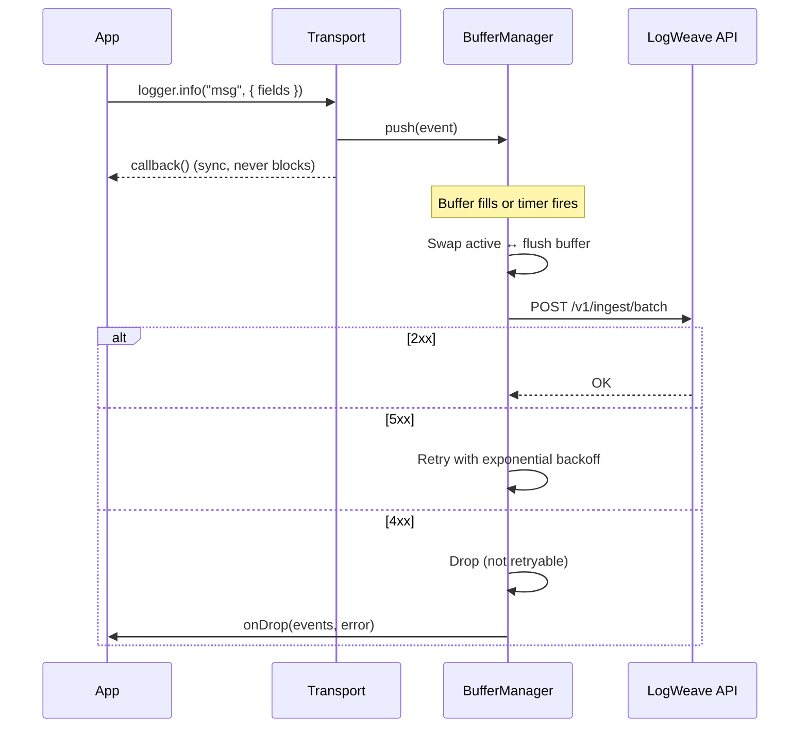

# @logweave/transport

Winston transport for [LogWeave](https://github.com/logweave/logweave) — buffers log events and sends them in batches to the LogWeave API. Non-blocking, retry-aware, and drop-safe.

## Install

```bash
npm install @logweave/transport
# or
pnpm add @logweave/transport
```

**Peer dependencies:** `winston ^3.0.0`, `winston-transport ^4.0.0`

## Usage

```typescript
import winston from 'winston'
import { LogWeaveTransport } from '@logweave/transport'

const logger = winston.createLogger({
  transports: [
    // Your normal console transport
    new winston.transports.Console(),

    // LogWeave — buffer + batch + retry in the background
    new LogWeaveTransport({
      apiKey: process.env.LOGWEAVE_API_KEY ?? '',
      service: 'payment-service',
      environment: 'production',
    }),
  ],
})

// These calls never block — events are buffered and flushed async
logger.info('user logged in', { userId: 123, route: '/login' })
logger.error('payment failed', { orderId: 'abc-123', amount: 99.99 })
```

## How It Works



The transport uses **double-buffering** — while one batch flushes over the network, new events accumulate in a separate buffer. This means flushing never blocks logging.

## Configuration

```typescript
new LogWeaveTransport({
  // Required
  apiKey: 'sk-your-api-key',      // Bearer token for API auth
  service: 'my-service',          // Service name (sent at batch level)

  // Optional
  endpoint: 'http://localhost:3000/v1/ingest/batch',  // Default
  environment: 'production',      // Environment tag
  bufferSize: 1000,               // Max events before auto-flush (default: 1000)
  flushIntervalMs: 5000,          // Timer-based flush interval (default: 5000)
  timeoutMs: 2000,                // HTTP timeout per attempt (default: 2000)
  maxRetries: 3,                  // Retries on 5xx/network error (default: 3)
  onDrop: (events, error) => {},  // Called when a batch is permanently dropped
})
```

| Option | Type | Default | Description |
|--------|------|---------|-------------|
| `apiKey` | `string` | **required** | Bearer token for API authentication |
| `service` | `string` | **required** | Service name identifier |
| `endpoint` | `string` | `http://localhost:3000/v1/ingest/batch` | LogWeave API endpoint |
| `environment` | `string` | — | Environment tag (e.g. `production`) |
| `bufferSize` | `number` | `1000` | Events before auto-flush |
| `maxRetainedEvents` | `number` | `50000` | Hard cap on buffered events when the API is slow/down — beyond it the oldest events are dropped so the SDK can't OOM your app |
| `flushIntervalMs` | `number` | `5000` | Flush timer interval (ms) |
| `timeoutMs` | `number` | `2000` | HTTP request timeout per attempt |
| `maxRetries` | `number` | `3` | Max retries on 5xx or network errors |
| `onDrop` | `function` | — | `(events, error) => void` — called on permanent drop |

## Retry Behavior

| Response | Action |
|----------|--------|
| **2xx** | Success |
| **429** | Retry after `Retry-After` header (capped at 30s), or exponential backoff if absent |
| **Other 4xx** | Drop immediately (client error, not retryable) |
| **5xx** | Retry with exponential backoff + jitter |
| **Network error** | Retry with exponential backoff + jitter |
| **Timeout** | Retry (per-attempt via `AbortSignal.timeout`) |

Backoff: `random(0, 1000ms * 2^attempt)` — max ~4s delay on attempt 3.

With `maxRetries: 3`, a failing batch gets 4 total attempts (1 initial + 3 retries) before being dropped.

## Graceful Shutdown

```typescript
// Flush remaining events on process exit
await logger.close()
```

The transport flushes any buffered events during `close()`. All timers use `.unref()` so the transport never keeps your process alive.

## Drop Handling

When a batch can't be delivered after all retries, the `onDrop` callback fires:

```typescript
new LogWeaveTransport({
  apiKey: '...',
  service: 'my-service',
  onDrop: (events, error) => {
    console.error(`Dropped ${events.length} log events: ${error.message}`)
    metrics.increment('logweave.drops', events.length)
  },
})
```

The `events` array is `readonly` — you can inspect but not modify the dropped events.

`onDrop` fires in two situations:

- **Retry exhaustion** — a batch couldn't be delivered after all retries.
- **Retention cap** — when the API is slow or down a flush stays in-flight and
  new events accumulate. Once `maxRetainedEvents` is reached the **oldest**
  buffered events are dropped first (most-recent context is kept), bounding
  memory so the SDK can never OOM your application.

## Observability

`getStats()` returns a snapshot of runtime counters:

```typescript
const { bufferedEvents, droppedEvents } = transport.getStats()
// bufferedEvents — events in the active buffer (excludes an in-flight batch)
// droppedEvents  — total events dropped (retention-cap + retry exhaustion)
```

## Event Shape

The transport extracts standard Winston fields and passes everything else as custom fields:

```typescript
logger.info('order placed', {
  userId: 42,
  orderId: 'ord-123',
  amount: 99.99,
})

// Sent to API as:
{
  "service": "my-service",
  "environment": "production",
  "events": [{
    "timestamp": "2026-03-16T10:30:00.000Z",
    "level": "info",
    "message": "order placed",
    "userId": 42,
    "orderId": "ord-123",
    "amount": 99.99
  }]
}
```

Service and environment are sent at the **batch level** (not per-event) to reduce payload size.

## Requirements

- Node.js 20+
- Works from both ESM (`import`) and CommonJS (`require`) projects

## License

MIT — this package only.

The LogWeave server that this transport connects to is licensed under the [Business Source License 1.1](https://github.com/logweave/logweave/blob/main/LICENSE) (free to self-host, converts to Apache 2.0 in 2030).
