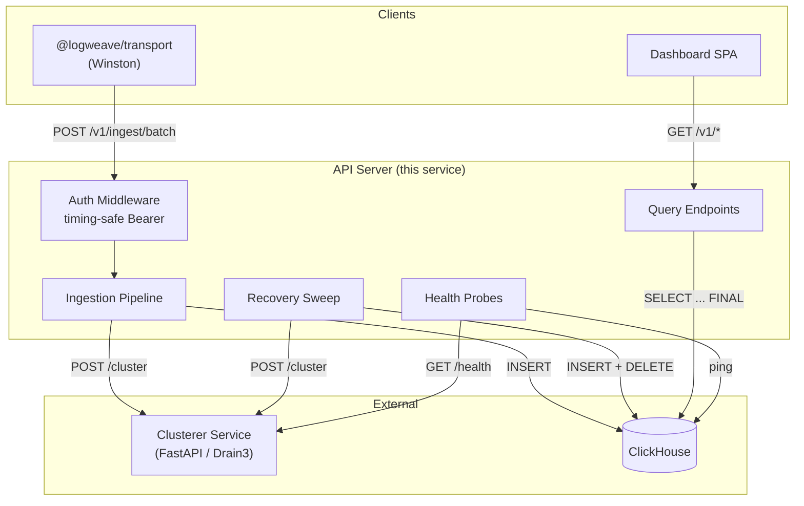
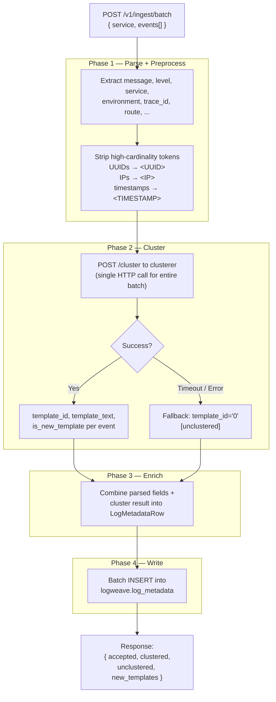
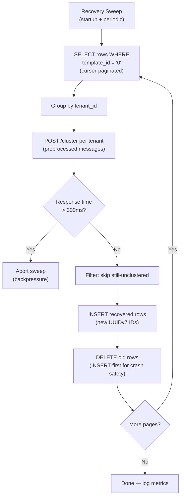
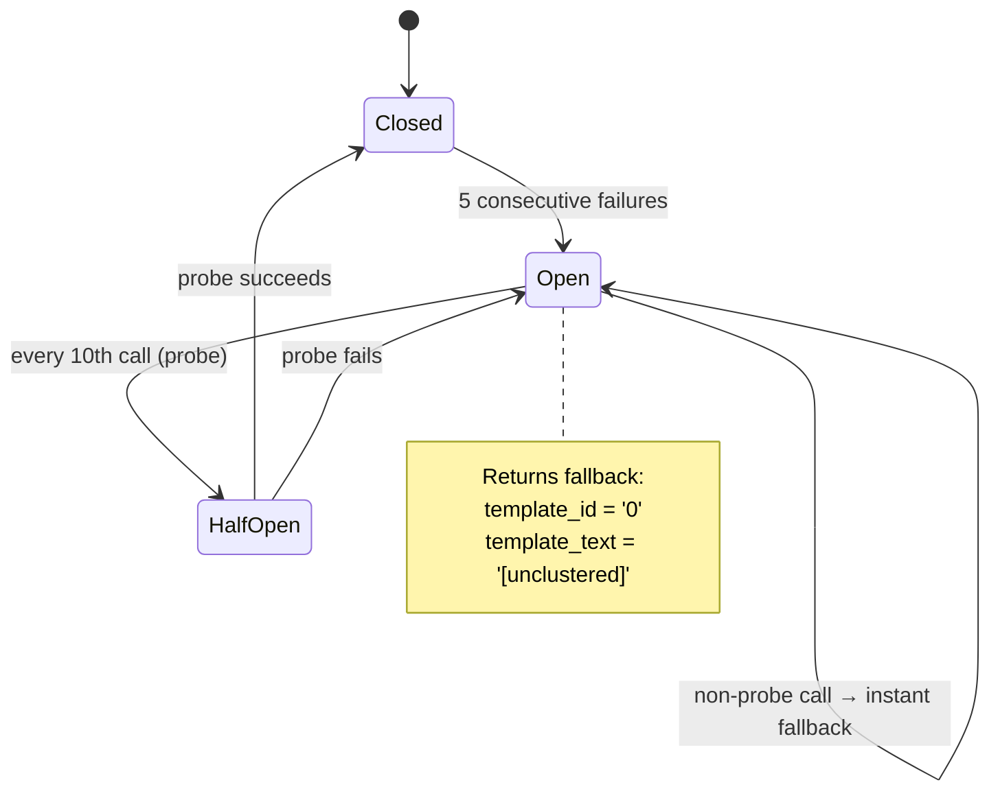

# LogWeave API Server

Express/TypeScript server handling log ingestion, metadata storage, recovery, and dashboard queries. Receives log events via the transport SDK, coordinates with the clusterer for template extraction, and writes metadata to ClickHouse.

## Architecture

### System Context



### Ingestion Pipeline

Four-phase pipeline processes every batch:



### Recovery System

Background sweep re-clusters events that failed clustering on first pass:



### Circuit Breaker (ClusterClient)



## Endpoints

| Method | Path | Auth | Description |
|--------|------|------|-------------|
| `GET` | `/healthz` | No | Liveness probe — always `{ status: 'ok' }` |
| `GET` | `/readyz` | No | Readiness — ClickHouse ping, clusterer health, circuit state, metrics |
| `POST` | `/v1/ingest/batch` | Bearer | Batch ingest — 1-1000 events per request |

### POST /v1/ingest/batch

**Request:**
```json
{
  "service": "payment-service",
  "environment": "production",
  "neverExtract": ["transaction_id"],
  "events": [
    { "message": "User 123 logged in", "level": "info" },
    { "message": "Payment failed for order abc", "level": "error", "route": "/pay" }
  ]
}
```

**Response (200):**
```json
{
  "accepted": 2,
  "clustered": 2,
  "unclustered": 0,
  "new_templates": 1
}
```

## Configuration

| Variable | Default | Description |
|----------|---------|-------------|
| `LOGWEAVE_PORT` | `3000` | HTTP server port |
| `LOGWEAVE_CLICKHOUSE_URL` | required | ClickHouse HTTP URL |
| `LOGWEAVE_CLUSTERER_URL` | required | Clusterer base URL |
| `LOGWEAVE_API_KEYS` | required | JSON `{"api-key": "tenant-id"}` |
| `LOGWEAVE_CLUSTERER_TIMEOUT_MS` | `500` | Cluster request timeout |
| `LOGWEAVE_LOG_LEVEL` | `info` | pino log level |
| `LOGWEAVE_SHUTDOWN_TIMEOUT_MS` | `10000` | Graceful shutdown deadline |
| `LOGWEAVE_RECOVERY_INTERVAL_MS` | `60000` | Recovery sweep interval |
| `LOGWEAVE_RECOVERY_LOOKBACK_HOURS` | `24` | Recovery query window |

## ClickHouse Schema

### Tables

- **`log_metadata`** — MergeTree, partitioned by month, TTL 30 days. Primary store for all processed log metadata.
- **`template_stats`** — AggregatingMergeTree, 5-minute buckets per template (excludes unclustered).
- **`service_stats`** — AggregatingMergeTree, hourly buckets per service.

### Materialized Views

- **`template_stats_mv`** — auto-aggregates template occurrences (WHERE template_id != '0')
- **`service_stats_mv`** — auto-aggregates service-level metrics (all rows)

## Module Structure

```
src/
├── index.ts              Server startup, graceful shutdown
├── app.ts                Express factory, middleware wiring
├── config.ts             Zod schema for env vars
├── logger.ts             pino + AsyncLocalStorage context
├── metrics.ts            In-memory counters
├── errors.ts             AppError + factory functions
├── http-status.ts        Status code constants
├── types.ts              Shared TypeScript types
├── middleware/
│   ├── auth.ts           SHA-256 timing-safe Bearer auth
│   ├── validate.ts       Zod body validation
│   ├── request-id.ts     X-Request-ID + AsyncLocalStorage
│   └── error-handler.ts  Centralized error handling
├── routes/
│   ├── health.ts         /healthz, /readyz
│   └── ingest.ts         POST /v1/ingest/batch
├── pipeline/
│   ├── parse.ts          JSON log parser (field extraction)
│   ├── preprocess.ts     High-cardinality token stripping
│   ├── cluster-client.ts ClusterClient + circuit breaker
│   ├── ingest.ts         4-phase pipeline orchestrator
│   └── types.ts          Pipeline type chain
├── db/
│   ├── client.ts         DbClient wrapper
│   ├── schema.ts         DDL + init
│   ├── insert.ts         Batch INSERT
│   ├── queries.ts        Parameterized SELECT queries
│   └── index.ts          Barrel export
├── recovery/
│   └── reconcile.ts      Recovery sweep (cursor-paginated)
└── clients/
    ├── clickhouse.ts     ClickHouse client factory
    └── clusterer.ts      Clusterer health checker
```

## Development

```bash
pnpm install
pnpm dev            # tsx watch + pino-pretty
pnpm test           # all tests
pnpm test:unit      # unit tests only
pnpm test:integration  # requires ClickHouse
pnpm lint           # Biome check
pnpm typecheck      # tsc --noEmit
```

Integration tests require ClickHouse:

```bash
docker compose up clickhouse -d
```

## Test Structure

```
tests/
├── unit/                     Isolated, no external deps
│   ├── auth.test.ts
│   ├── config.test.ts
│   ├── health.test.ts
│   ├── ingest.test.ts
│   ├── error-handler.test.ts
│   ├── request-id.test.ts
│   ├── security-headers.test.ts
│   └── pipeline/
│       ├── parse.test.ts
│       ├── preprocess.test.ts
│       ├── cluster-client.test.ts
│       └── timestamp.test.ts
├── integration/              Requires ClickHouse
│   ├── db/                   Schema, insert, queries, MVs
│   ├── pipeline/             Full cluster flow
│   └── recovery/             Recovery sweep
└── e2e/                      Full stack (docker compose)
```
