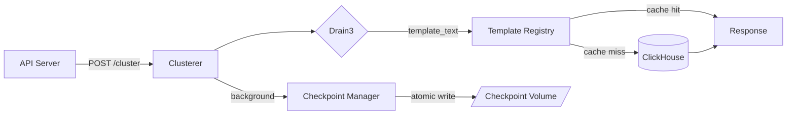
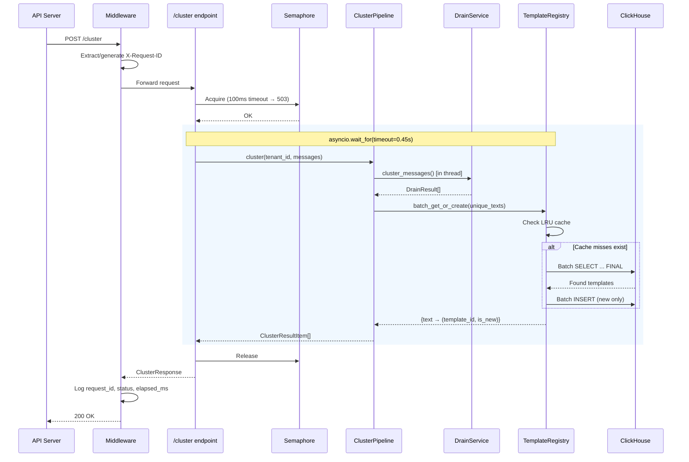
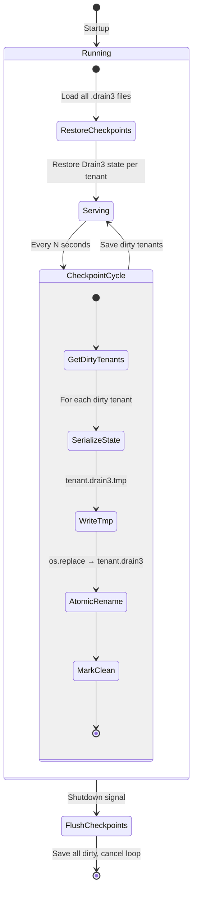
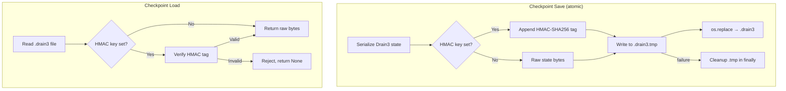

# LogWeave Clusterer

Log template extraction service powered by [Drain3](https://github.com/logpai/Drain3). Takes raw log messages, clusters them into template patterns, and assigns stable UUIDv7 template IDs via ClickHouse.

**Key property:** the clusterer never stores raw log content. It extracts structural patterns (templates) and discards the original messages. Raw logs stay in the customer's infrastructure.

## How Data Flows

Log messages arrive via `POST /cluster`, get clustered by Drain3 into template patterns, receive stable IDs from the template registry, and return as structured results. The checkpoint system persists Drain3 state across restarts.



### Request Flow



### Checkpoint Lifecycle

Drain3 state is serialized periodically and on shutdown. Checkpoints use atomic rename to prevent corruption, with optional HMAC-SHA256 integrity verification.





## Architecture

| Component | Responsibility |
|---|---|
| **DrainService** | Per-tenant Drain3 instances, thread-safe clustering, dirty tracking |
| **TemplateRegistry** | UUIDv7 ID assignment, LRU cache, batch ClickHouse operations |
| **CheckpointManager** | Atomic persistence, HMAC verification, stale tmp cleanup |
| **ClusterPipeline** | Orchestrates drain → registry → checkpoint lifecycle |
| **main.py** | FastAPI app, lifespan, middleware, backpressure controls |

## Endpoints

| Endpoint | Method | Purpose |
|---|---|---|
| `/health` | GET | Liveness probe — always 200 |
| `/ready` | GET | Readiness probe — checks ClickHouse (5s cache) |
| `/cluster` | POST | Cluster messages, return template IDs |

## Configuration

All settings use the `LOGWEAVE_` env prefix. See `.env.example` for the full list.

Key settings:

| Variable | Default | Description |
|---|---|---|
| `LOGWEAVE_CLICKHOUSE_URL` | `clickhouse://localhost:9000/logweave` | ClickHouse DSN |
| `LOGWEAVE_DRAIN3_SIM_TH` | `0.4` | Drain3 similarity threshold |
| `LOGWEAVE_MAX_CONCURRENT_REQUESTS` | `4` | Semaphore limit for /cluster |
| `LOGWEAVE_REQUEST_TIMEOUT_SECONDS` | `0.45` | Per-request timeout |
| `LOGWEAVE_MAX_TENANTS` | `200` | Max concurrent tenants |
| `LOGWEAVE_CHECKPOINT_HMAC_KEY` | _(empty)_ | HMAC key for checkpoint integrity |

## Development

```bash
cd services/clusterer
uv sync --dev
uv run poe test      # 96 tests
uv run poe check     # lint + format check
uv run poe serve     # dev server with hot reload
```
